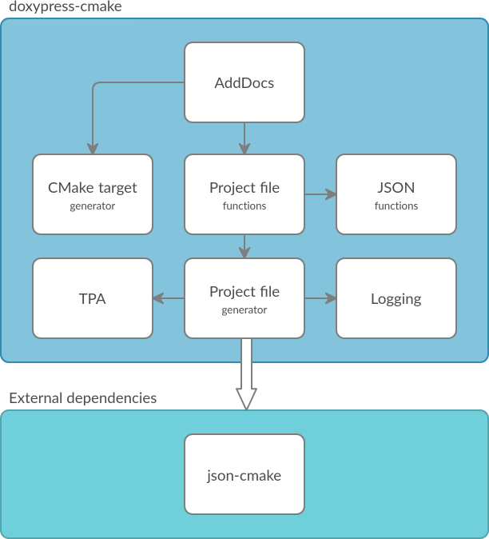

Components
----------

* ``AddDocs`` module implements :cmake:command:`doxypress_add_docs`, the only
  public function in the package
* ``ProjectFunctions`` module implements project file manipulation functions
* ``CMakeTargets`` module implements creation of CMake targets and `install`
  commands
* ``ProjectFileGenerator`` module generates the processed project file
* ``JSONFunctions`` module implements JSON manipulation functions (except
  parsing, which is handled by json-cmake_)
* ``PropertyHandlers`` module implements a number of functions that modify
  a certain property according to that property's semantics
* ``TPA`` module implements :ref:`TPA scopes<TPA scope>`
* ``Logging`` module implements logging functions

.. toctree::
   ProjectFileGenerator
   ProjectFunctions
   CMakeTargetGenerator
   JSONFunctions
   PropertyHandlers
   Logging
   TPA

.. _json-cmake: https://github.com/sbellus/json-cmake